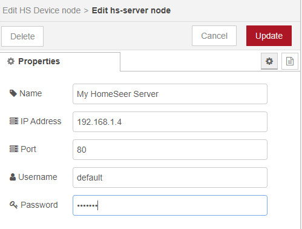

# HomeSeer Nodes for Node-RED

This software provide Node-RED nodes to control and monitor your HomeSeer devices and events. It is compatible with **HomeSeer version 4.1.3.0 or later**.

## Installation

Use the following command from within your user data directory (by default, `$HOME/.node-red`):
```
npm install node-red-contrib-homeseer
```
Then restart Node-RED, the new HomeSeer nodes will appear in the palette:


## Configuration

In order for Node-RED to receive device status updates from HomeSeer you need to setup a webhook URL. From the HomeSeer web interface go to **Setup > Custom** and add your Node-RED URL followed by **/homeseer/webhook**. For example if Node-RED is running on the same machine as HomeSeer, it should be something  like http://127.0.0.1:1880/homeseer/webhook


Every HomeSeer node will have a **HS Server** property which must be configured. You only have to create this configuration once when you create your first node.



## Available Nodes

### HS Device
Node representing a HomeSeer Device or Feature. To control a device this node needs to receive on its input, a message with either `msg.payload.value` property set to the control value to use, or the  `msg.payload.status` property set to the control text status to use. 


Every time the device value or status changes in HomeSeer the node will send to its output a message containing the new state of the device in `msg.payload`
```javascript
{
    payload: {
    	ref: 1234,
        value: 1,
        status: 'On'
    }
}
```

### HS Event
Node representing a HomeSeer Event. To run the event actions, this node needs to receive on its input, a message with the `msg.topic` property set to `run`

