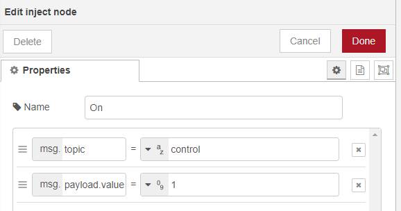
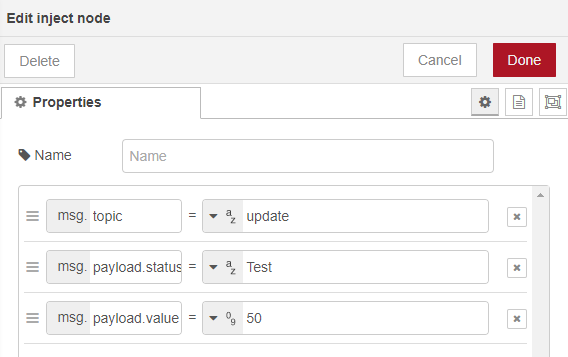

# HomeSeer Nodes for Node-RED

This software provides Node-RED nodes to control and monitor your HomeSeer devices and events. It is compatible with **HomeSeer version 4.1.3.0 or later** and **Node-Red version 1.0 or later**.

## Installation

### From Node-RED (preferred)
Go to Menu > Manage Palette > Install tab, search for **node-red-contrib-homeseer** then click the install button.

### From the command line
Use the following command from within your user data directory (by default, `$HOME/.node-red`):
```
npm install node-red-contrib-homeseer
```
Then restart Node-RED

If the installation is successful, the new HomeSeer nodes will appear in the palette:


## Configuration

In order for Node-RED to receive device status updates from HomeSeer you need to setup a webhook URL. From the HomeSeer web interface go to **Setup > Custom** and add your Node-RED URL followed by **/homeseer/webhook**. For example if Node-RED is running on the same machine as HomeSeer, it should be something  like http://127.0.0.1:1880/homeseer/webhook


Every HomeSeer node will have a **HS Server** property which must be configured. You only have to create this configuration once when you create your first node.


Username and Password are optional fields, but if in HomeSeer,  **Setup > Network > Web Server Settings > No Password Required for local Login** is uncheked then you must provide a valid HomeSeer username and password.

## Available Nodes

### HS Device
Node representing a HomeSeer Device or Feature. 

#### Controlling a Device
To control a device the node needs to receive on its input, a message with `msg.topic` set to `control` and either `msg.payload.value` property set to the control value to use, or the  `msg.payload.status` property set to the control text status to use. 




#### Updating a Device's value and/or status
To update a device's value and/or status, the node needs to receive on its input, a message with `msg.topic` set to `update` and either `msg.payload.value` property set to the new value, or the `msg.payload.status` property set to the new status, or both. 




#### Receiving Device updates
Every time the device value or status changes in HomeSeer the node will send to its output a message containing the new state of the device in `msg.payload`
```javascript
{
    payload: {
    	ref: 1234,
        value: 1,
        status: 'On'
    }
}
```

#### Forcing a Device update
If the node receives a message with `msg.topic` set to `sync` it will get the current state of the device from HomeSeer and send it to its output in `msg.payload` even if no changes has occured since the last update.

#### Reporting Device current state
If the node receives a message with `msg.topic` set to `report` it will send to its output the last known state of the device without querying HomeSeer. 

### HS Event
Node representing a HomeSeer Event. To run the event actions, this node needs to receive on its input, a message with the `msg.topic` property set to `run`


